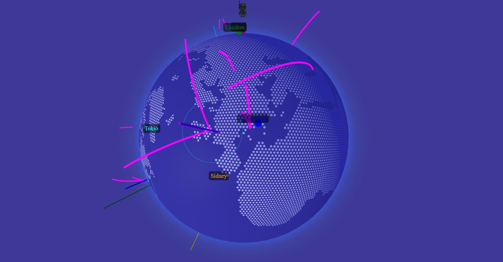

# Globo Interactivo con Modelo 3D en París

## Acceso Rápido a la Aplicación
[Visitar Aplicación](https://xococode.github.io/World3d.github.io.github.io/)

## Descripción

Este proyecto presenta un globo interactivo en 3D ambientado en París, desarrollado con **Three.js** y **ThreeGlobe**. La aplicación renderiza un globo terráqueo con polígonos hexagonales para representar países y añade funcionalidades interactivas, como la animación de puntos, anillos de expansión (ripple) y trayectorias de vuelo. Además, integra modelos 3D que se posicionan y orientan de forma precisa sobre la superficie del globo.

## Características

- **Visualización 3D Interactiva**  
  Utiliza Three.js para renderizar un entorno 3D inmersivo, con iluminación ambiental y direccional, y permite la interacción mediante controles de cámara.

- **Globo con Polígonos Hexagonales**  
  Los países se muestran mediante polígonos hexagonales, ofreciendo una estética moderna y dinámica.

- **Animación de Puntos y Efectos Ripple**  
  - **Puntos Animados**: Se cargan y animan puntos a partir de datos externos (`randomPoints.json`), modificando su tamaño en función del tiempo.  
  - **Anillos Expansivos (Ripple)**: Se generan anillos que simulan ondas propagándose, usando shaders personalizados para efectos visuales.

- **Trayectorias de Vuelo Dinámicas**  
  Representa rutas de vuelo con arcos animados que se actualizan periódicamente a partir de archivos JSON externos (`flightPaths.json` y `flightPaths1.json`).

- **Marcadores y Etiquetas**  
  - **Marcadores Esféricos**: Se añaden marcadores en el globo con etiquetas informativas y enlaces externos.  
  - **Modelo 3D en París**: Se carga un modelo GLB que se posiciona y orienta en la ciudad de París, alineándose con la curvatura del globo.

- **Controles Interactivos**  
  Emplea `TrackballControls` para permitir la rotación, el zoom y la exploración interactiva del globo.

- **Adaptabilidad y Rendimiento**  
  El renderizado se adapta al tamaño de la ventana, garantizando una experiencia óptima en dispositivos de escritorio y móviles.

## Funcionamiento Interno

1. **Inicialización del Globo**  
   - Se crea un objeto `ThreeGlobe` configurado con un material personalizado y datos GeoJSON de países.
   - Se añade un halo con efectos de shader para resaltar la atmósfera del globo.

2. **Carga de Datos Externos**  
   Se realizan peticiones asíncronas para obtener:
   - Puntos animados desde `randomPoints.json`.
   - Datos para anillos (ripple) desde `rippleData.json`.
   - Información de marcadores desde `markers.json`.
   - Trayectorias de vuelo desde `flightPaths.json` y `flightPaths1.json`.

3. **Integración de Modelos 3D**  
   Se utiliza `GLTFLoader` para cargar y posicionar un modelo 3D en París, aplicando transformaciones para que se alinee correctamente con la normal de la superficie del globo.

4. **Animación y Ciclos de Actualización**  
   - El ciclo de animación actualiza continuamente la rotación del globo, la animación de puntos y el efecto del halo.
   - Se gestionan ciclos independientes para actualizar las trayectorias de vuelo, combinando datos de diferentes fuentes en intervalos definidos.

5. **Optimización y Adaptabilidad**  
   Se implementa una lógica para ajustar la cámara y el renderizado al tamaño de la ventana, asegurando una experiencia fluida e interactiva.

   
## Descargo de Responsabilidad

**Importante:** El uso de este código es bajo total responsabilidad del usuario. ** Xocostudio** no se hace responsable por ningún tipo de mal uso, daño directo o indirecto, pérdida de datos, o cualquier otro perjuicio que pueda derivarse del uso de este software.

### Sin Garantías

El software se proporciona "tal cual", sin garantías de ningún tipo, ya sean expresas o implícitas. Esto incluye, pero no se limita a, las garantías de comerciabilidad, adecuación para un propósito particular y no infracción.

### Exención de Responsabilidad

Los autores no son responsables por cualquier reclamación, daño u otra responsabilidad que surja del uso del software, ya sea en una acción de contrato, agravio o de otra manera, que surja de, fuera de o en conexión con el software o el uso u otros tratos en el software.

### Uso del Código

Al descargar y utilizar este código, aceptas hacerlo bajo tu propio riesgo. Es tu responsabilidad asegurarte de que el software es adecuado para tus necesidades y de tomar todas las precauciones necesarias para evitar posibles daños o pérdidas.

Si tienes alguna pregunta o necesitas más información, por favor contacta a Xocostudio.

---

*¡Gracias por utilizar nuestro software! Asegúrate de leer y entender este descargo de responsabilidad antes de proceder.*

---

